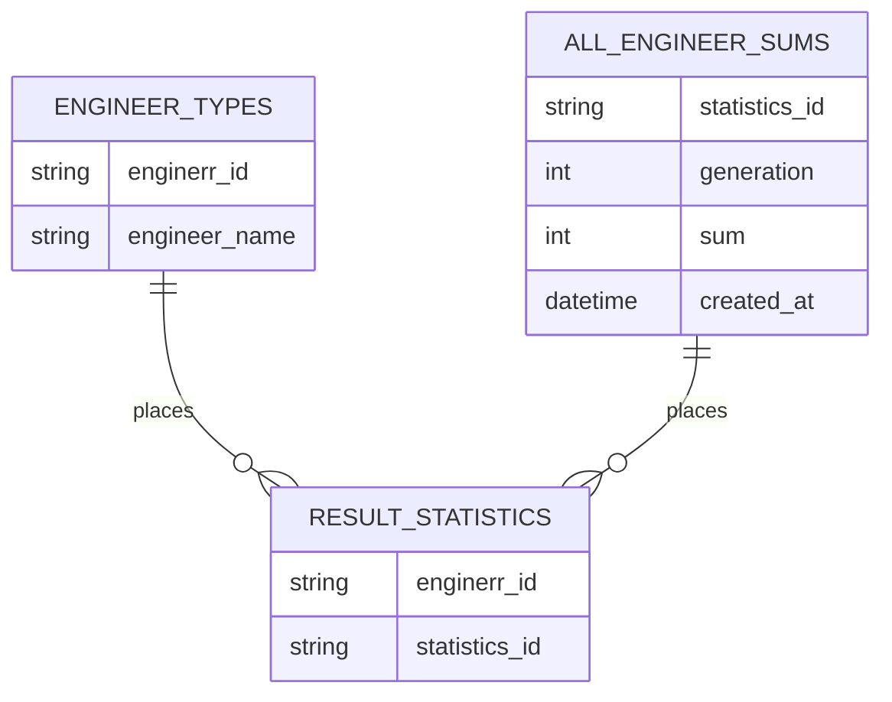

# ER図

https://mermaid.live/edit

## 統計データ保存 

```mermaid
erDiagram
    RESULT_STATISTICS {
        string enginerr_id
        string statistics_id
    }
    ENGINEER_TYPES ||--o{ RESULT_STATISTICS : places
    ENGINEER_TYPES {
        string enginerr_id
        string engineer_name
    }
    ALL_ENGINEER_SUMS ||--o{ RESULT_STATISTICS : places
    ALL_ENGINEER_SUMS {
        string statistics_id
        int generation
        int sum
        datetime created_at
    }
```
